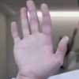
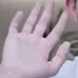

# **Sign Language Dataset Generator**

This program extracts **hand images from videos** and converts them into a **picture dataset**. It processes video files, detects hands, and saves cropped hand images as **PNG files** (or other formats).  

## **Features**  
✅ Extracts hands from **videos or live webcam feeds**  
✅ Supports multiple video formats: **MP4, AVI, MOV, MKV, WMV**  
✅ Allows **custom padding, flipping, and extraction timing**  
✅ Saves images in a structured dataset format \
✅ **Random brightness adjustments** to simulate different lighting conditions  
✅ **Random horizontal flipping** for variation in hand orientation  
✅ **Random rotations** within a specified degree range

## **Demo**  

  

## **Sample Output Images**  

Here are some extracted hand images from the processed videos:  

<table align="center">
  <tr>
    <td></td>
    <td></td>
    <td></td>
    <td></td>
    <td></td>
  </tr>
  <tr>
    <td></td>
    <td></td>
    <td></td>
    <td></td>
    <td></td>
  </tr>
</table>

## **Randomized Images of the Above**  

Here are some extracted hand images from the processed videos:  

<table align="center">
  <tr>
    <td></td>
    <td></td>
    <td></td>
    <td></td>
    <td></td>
  </tr>
  <tr>
    <td></td>
    <td></td>
    <td></td>
    <td></td>
    <td></td>
  </tr>
</table>


## **How to Process Videos**  

### **Settings**  

Modify these parameters in the script to adjust extraction behavior:  

```python
height_width = 100        # Output image size (square format)
output_format = "png"     # File format of extracted images
buffer = 5                # Padding (%) around the hand
flipped = True            # Flip video horizontally
start_extraction = 1.5    # Seconds before extraction begins
num_sec = 2.5             # Duration of extraction in seconds
```

### **Processing Videos**  
1. Place the videos you want to process inside the **`input_videos`** folder.  
2. The output images will be saved in **`output_images`**, inside a folder named after the input video filename (without the extension).  

For example:  
- Input video: `input_videos/example.mp4`  
- Extracted images will be stored in: `output_images/example/`  

### **Run the Extraction**  

- **Process a specific video:**  
  ```python
  process("example.mp4")
  ```
- **Process all videos in the `input_videos` folder:**  
  ```python
  process_all()
  ```
- **Use a webcam instead of a video file:**  
  ```python
  process()
  ```


## **How to Add Randomness** 
### **Settings**  

Modify these parameters in `randomize.py` to control the randomness:  

```python
random_brightness = True  # Enable/disable brightness variation
random_hflip = True       # Enable/disable horizontal flip
random_rotation = True    # Enable/disable image rotation

brightness_magnitude = 30  # Maximum brightness shift (± value)
rotation_magnitude = 10    # Maximum rotation angle (degrees)
```

  1. Make sure you have processed videos and generated hand images.  
  2. Run `randomize.py` to apply transformations to all extracted images:  

   ```sh
   python randomize.py
   ```  

  3. The modified images will be saved in **`randomized_images/`**, preserving the folder structure of `output_images/`.  

## **Installation & Dependencies**  

1. Clone the repository:  
   ```sh
   git clone https://github.com/UPD-IM-FSL-Project/Sign-Language-Dataset-Generator
   cd Sign-Language-Dataset-Generator
   ```
2. Install required dependencies:  
   ```sh
   pip install -r requirements.txt
   ```
3. Run the program:  
   ```sh
   python extract.py
   ```
3. Add randomness (optional):  
   ```sh
   python randomize.py
   ```

## **Credits**  
The following videos were used for testing:  
- **test1.mp4**: [YouTube Link](https://www.youtube.com/watch?v=xmMKH_R2HAE)  
- **test2.mp4**: [YouTube Link](https://www.youtube.com/watch?v=wihY-cSsoRg)  
- **test3.mp4**: [YouTube Link](https://www.youtube.com/watch?v=8OqOMV-f6hA)  
